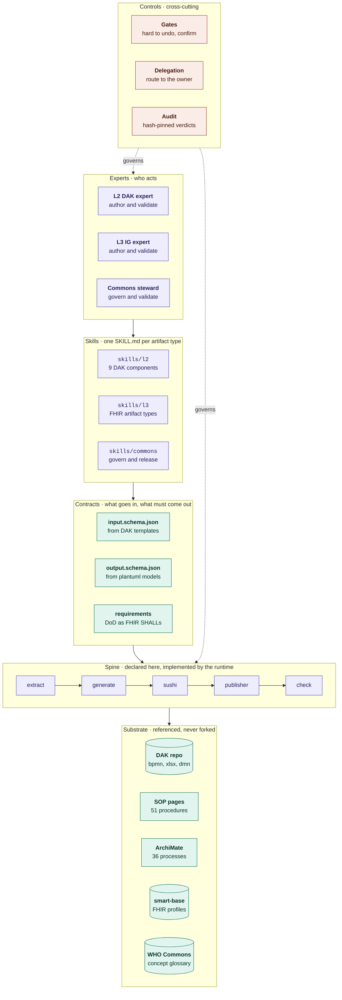
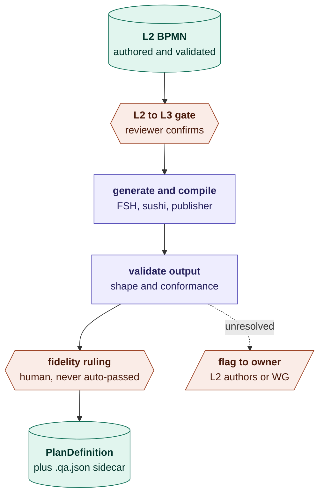

# Architecture

Two diagrams. The first is the layer stack — what the package is. The second is one artifact
travelling through it end to end — what the package does.

Both are Mermaid, so they render on GitHub and read as text to an agent. Colour follows the
convention in [`diagram_legend.md`](../input/pagecontent/diagram_legend.md): application layer
versus technology layer, things that act versus things acted on, plus one ramp for the control
plane, which is neither.

---

## The stack

Read bottom-up and each layer exists to make the one above it possible.

| Layer | Question it answers | Note |
|---|---|---|
| **Controls** | What was decided, by whom, on what evidence? | Not a stage. A property of every action. |
| **Experts** | Who may do this, with what tools? | A bundle of skills plus a role. Scopes which skills load and which gates apply. |
| **Skills** | Who may author this, and under what contract? | One `SKILL.md` per artifact type, pointing at the SOP that holds the procedure. |
| **Contracts** | Did it produce the right shape? | The only thing a validator and an LLM both consume without interpretation. |
| **Spine** | Is this reproducible? | Declared, not shipped. See [`spine/INTERFACE.md`](spine/INTERFACE.md). |
| **Substrate** | What already exists? | Referenced, never forked. |

The substrate is the reason the package is small. The procedures, the formal model, the templates
and the conformance profiles all exist already; what was missing was anything binding them
together.

---

## One artifact end to end

The BPMN vertical — the shortest complete path that exercises every layer, and the reference
implementation for every other skill.

Two things are worth reading off this.

**Only two nodes stop the flow** — the gate and the fidelity ruling. Everything between them runs
freely. A gate on a cheap, reversible action is friction that teaches people to click through
gates, which costs more than it buys.

**The flag is the only sideways arrow.** A question the DAK does not settle leaves the pipeline
rather than blocking it. That is what makes the throughput claim survive contact with real DAKs:
review effort tracks the number of decisions, not the number of artifacts.

### The skills in this vertical

| Skill | Determinism | SOP source |
|---|---|---|
| [`l2/author-business-processes`](skills/l2/author-business-processes/SKILL.md) | judgment | `l2_dak_authoring.md` §2.1.4 |
| [`l2/validate-business-processes`](skills/l2/validate-business-processes/SKILL.md) | deterministic | `l2_dak_authoring.md` |
| [`l3/author-processes`](skills/l3/author-processes/SKILL.md) | judgment | `l3_processes.md` |
| [`l3/validate-processes`](skills/l3/validate-processes/SKILL.md) | deterministic | `l3_processes.md` DoD |

### What this vertical surfaces immediately

Running it against a published DAK makes three convention problems visible that hand-authoring
absorbs silently: a dotted DAK identifier used as a logical model id makes the dot a path separator
and the publisher rejects it; `^mapping.map` without a matching identity costs minutes in the
build; and a model using `^code` scores zero against a checker expecting `^mapping`, and vice
versa.

SUSHI reports clean on all three. They appear only in the IG Publisher, which is why
`validate-ig-build` is not optional and why the traceability convention is the first open decision
in the package.
