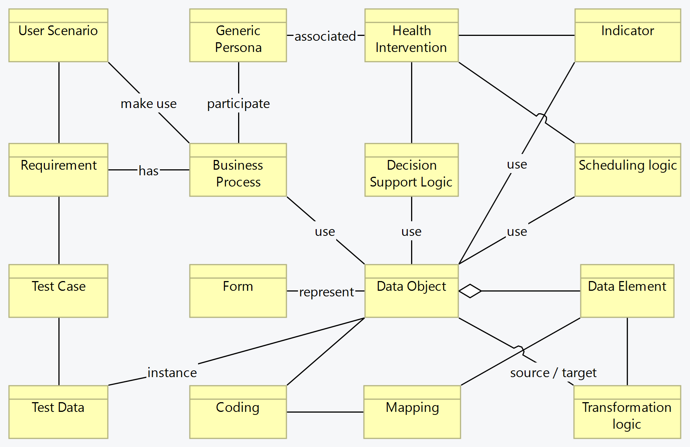

# Content Types ArchiMate Diagram - SMART Guidelines Starter Kit v2.1.0

* [**Table of Contents**](toc.md)
* [**L3 Authoring Overview**](authoring_overview.md)
* [**ArchiMate Diagrams Legend**](diagram_legend.md)
* **Content Types ArchiMate Diagram**

## Content Types ArchiMate Diagram

The SMART Guidelines define the provision of guidance and monitoring using a structured, standardized representation of knowledge of different types, which are represented in L2 and L3. The diagram and table here represent those concepts in a visual manner.

**Note: This diagram is not representative of the component/artifact names across L2 or L3, but is an abstract overview of concept types involved in the definition of SMART Guidelines.**

 

| | |
| :--- | :--- |
| Health Interventions | Initiatives about prevention, monitoring or addressing medical conditions. |
| Generic Personas | An archetype representing a person interacting with the system. This aids in understanding the motivations and potential actions of users within scenarios. |
| User Scenarios | A narrative or situation where users interact with a system, environment, or service. User scenarios guide many subsequent knowledge representation processes to ensure coverage and focus. |
| Business Process | A collection of related tasks or activities that achieve a specific organizational goal. Business processes often encompass or give rise to multiple user scenarios, especially in complex systems. |
| Requirement | A detailed specification of a system’s needs, derived from user scenarios, personas, and business processes. It forms the foundation for system design and testing. |
| Decision Table | A structured method for representing complex decision logic. This is a basis for developing business processes and transformation logic. |
| Scheduling Logic | The rules used to schedule tasks and interventions |
| Indicators | Metrics used to measure the performance or outcomes of business processes and health interventions, and guide decision-making. |
| Data Object | A comprehensive representation of information, often deriving from business processes or requirements. They encapsulate multiple data elements. |
| Data Element | An atomic piece of data, often a part of data objects. Elements get transformed, coded, or mapped as per transformation logic or coding systems. |
| Coding | The assignment of codes to data elements, where applicable, using standard terminologies and mapped to other codes as needed. Coding aids in ensuring that data elements are universally understood and interpretable. |
| Code Mapping | Mapping the codes from one system to another, ensuring that multiple representations, when possible, are documented and accessible. |
| Forms | A tool for data collection, often driven by the requirements of business processes or the need to collect specific data. |
| Transformation logic | The rules applied to change data from one format or structure to another. Often influenced by decision tables, coding, and mapping to ensure data integrity. |
| Test Case | A set of conditions for which a system is assessed, often derived from requirements and user scenarios. They ensure the system performs as expected. |
| Test Data | Specific data used to execute test cases, often derived from data objects and elements, ensuring testing of system functionalities. |

