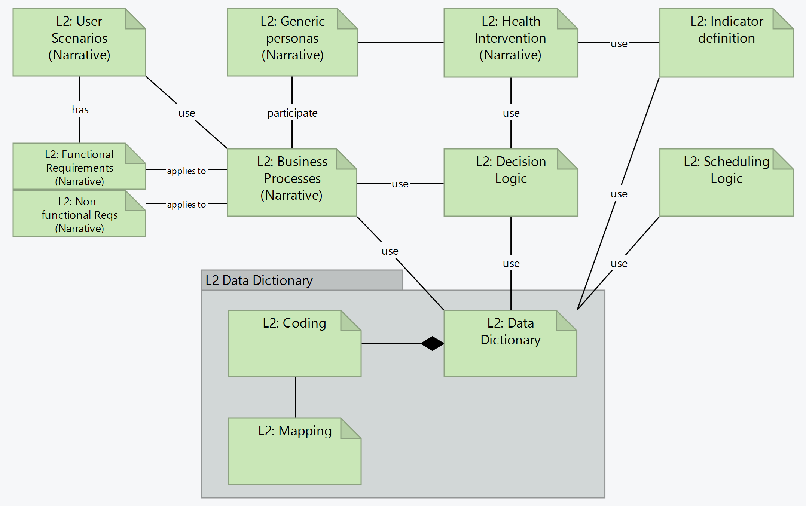

# L2 ArchiMate Diagram - SMART Guidelines Starter Kit v2.1.0

* [**Table of Contents**](toc.md)
* [**L3 Authoring Overview**](authoring_overview.md)
* [**ArchiMate Diagrams Legend**](diagram_legend.md)
* **L2 ArchiMate Diagram**

## L2 ArchiMate Diagram

The L2 content is presented in the artifacts represented in the ArchiMate diagram below:

  

