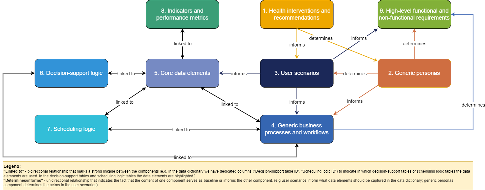
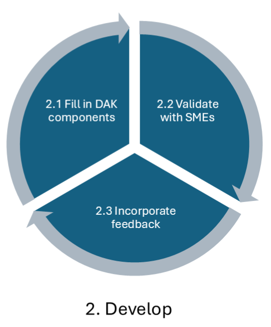
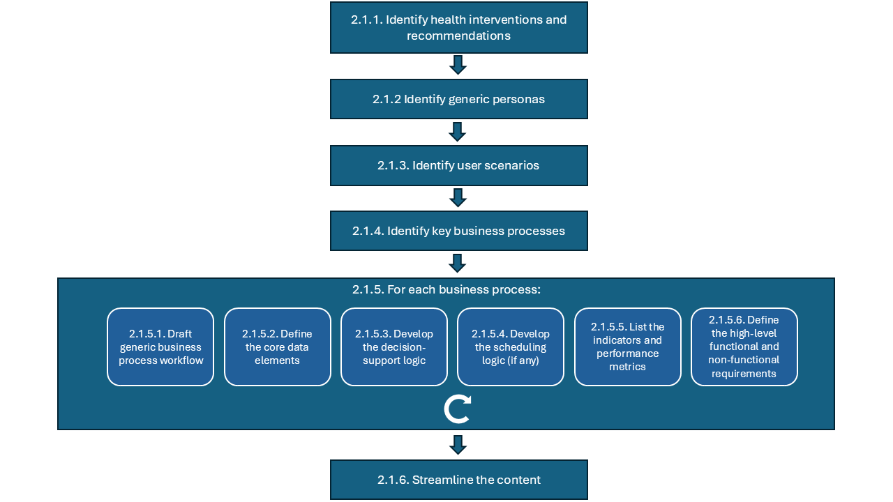

# Authoring a L2 DAK - SMART Guidelines Starter Kit v2.1.0

* [**Table of Contents**](toc.md)
* [**L2 Authoring Overview**](l2_authoring_overview.md)
* **Authoring a L2 DAK**

## Authoring a L2 DAK

While creating a WHO DAK, the focus is to transcribe health and data recommendations published and available in WHO guidelines and other normative products into the DAK components.

### DAK components

The DAK consists of 9 interlinked components: (1) health interventions and recommendations; (2) generic personas; (3) user scenarios; (4) generic business processes and workflows; (5) core data elements; (6) decision-support logic; (7) scheduling logic; (8) indicators and performance metrics; and (9) high-level functional and non-functional requirements. The table below provides an overview of each of the contributing components of the DAK.

| | | | |
| :--- | :--- | :--- | :--- |
| ** Component** | **Description** | **Purpose** | **Outputs/ artifacts** |
| 1. Health interventions and recommendations | Overview of the health interventions and health-specific recommendations included within this digital adaptation kit (DAK). DAKs are meant to be a repackaging and integration of L1 guidelines and guidance documents, such as WHO guidelines and other normative products and associated publications, in a particular health domain. The list of health interventions should be drawn from[the universal health coverage menu of interventions](https://www.who.int/universal-health-coverage/compendium/interventions-by-programme-area)acompiled by WHO and the digital health interventions should be extracted from the[WHO classification of digital health interventions](https://iris.who.int/handle/10665/373581)b. | **Setting the stage**to understand how the DAK would be applied to person-centred point-of-service systems (PCPOSS) in the context of specific health programmes and interventions. | **List of related health interventions**based on WHO’s universal health coverage essential interventions; and**List of related recommendations**based on guidelines and guidance documents.**List of digital health interventions**based on the WHO classification of digital health interventions. |
| 2. Generic personas | Depiction of the end users and related stakeholders who would be interacting with the digital system or involved in the care pathway. | **Contextualization**to understand the wants, needs and constraints of the end users. | **Description, competencies and essential interventions**performed by targeted personas. |
| 3. User scenarios | Narratives that describe how the different personas may interact with the digital system and with each other.The user scenarios are only illustrative and are intended to give an idea of a typical workflow. | **Contextualization**to understand how the system would be used, and how it would fit into existing workflows. | Example**narrative**of how the targeted personas may interact with the system and with each other during a workflow. |
| 4. Generic business processes and workflows | A business process is a set of related activities or tasks performed together to achieve the objectives of the health programme area, such as registration, counselling, referrals.Workflows are a visual representation of the progression of activities (tasks, decision points, interactions) that are performed within the business process. | **Contextualization and system design**to understand how the digital system would fit into existing workflows and how best to design the system for that purpose. | Overview**matrix**presenting the**key processes**in the specific health area; and**Workflows**for identified business processes with annotations |
| 5. Core data elements | Data elements are required throughout the different points of the workflow.These data elements are mapped to standards-based classifications and terminologies to ensure the data dictionary is compatible with other digital systems. | **System design and interoperability**to know which data elements need to be logged and how they map to other standard terminologies (e.g. ICD and LOINC) for interoperability with other standards-based systems. | List of data elements.**Data dictionary**with detailed data specifications in spreadsheet format. |
| 6. Decision-support logic | Decision-support logic and algorithms to support appropriate service delivery in accordance with clinical, public health and data use guidelines.**Scheduling logic**A specific type of decision-support logic to support appropriate reminders for follow-up visits and services in accordance with clinical, public health and data use guidelines. | **System design and adherence to recommended clinical practice**to know what underlying logic needs to be coded into the system.**(Scheduling Logic) System design and adherence to recommended clinical practice**to know what service schedules needs to be coded into the system so that appropriate reminders are generated. | List of decisions that need to be made throughout the encounter.**Decision-support tables**in a spreadsheet format with inputs, outputs and triggers for each decision-support logic.**Scheduling Logic**List of scheduling logic tables.**Scheduling logic**for services in spreadsheet format. |
| 7. Indicators and performance metrics | Core set of indicators that need to be aggregated for decision-making, performance metrics, and subnational and national reporting.These indicators and metrics are based on data that can feasibly be captured from a routine digital system, rather than survey-based tools. | **System design and adherence to recommended health monitoring practices**to know what calculations and secondary data use are needed for the system, based on the principle of “[collect once, use many](https://pubmed.ncbi.nlm.nih.gov/22195060/)”c. | **Indicators table**with numerator and denominator of data elements for calculation, along with appropriate disaggregation. |
| 8. High-level functional and non-functional requirements | A high-level list of core functions and capabilities that the system must have to meet the end users’ needs and achieve tasks within the business process. | **System design**to know what the system should be able to do. | **Tables of functional and non-functional requirements**with the intended end user of each requirement, and why that user needs that functionality in the system. |
| 9. Test scenarios | A high-level list of testing scenarios, including test data, that can be used to validate digital health systems adherence to DAK components. | **System validation**to validate that a system is behaving as expected. | **Test scenarios**for each of the Generic Personas, whether human or system, that is behaving according to the expected behaviour as described by a DAK artifact (e.g. functional requirement, business process, decision support table, indicators).**Test data**or descriptors for test data generators that can be used by one or more test scenarios. |

a - The universal health coverage menu of interventions[1](#fn:1).
 b - Classification of digital interventions, services and applications in health: a shared language to describe the uses of digital technology for health, 2nd ed.[2](#fn:2).
 c - Demonstrating “collect once, use many” – assimilating public health secondary data use requirements into an existing Domain Analysis Model[3](#fn:3).

Some of the dependencies between the components are:

* the first component, health interventions and recommendations, should be first drafted to establish scope;
* personas identified in component 2 “Generic personas” are the same personas that should be represented in the user scenarios and business processes, therefore component 2 should be drafted before developing user scenarios (component 3) and generic business processes and workflows (component 4);
* the actions performed by the generic personas (component 2) in the user scenarios (component 3) define the activities and their sequence, presented in the generic business processes and workflows (component 4), thus the user scenarios (component 3) should align with what is depicted in the workflows (component 4);
* The generic business processes and workflows (component 4) indicate when core data elements are collected (component 5), when decision-support logic (component 6) is needed, and when scheduling logic (component 7) is used, thus the core data elements, the decision-support logic tables and the scheduling logic tables are linked to activities from the business processes. Therefore, it is important to clearly define the workflow first. On the other hand, when designing the data dictionary and/or the decision-support tables, this can lead to modifications in the business processes. Although it is recommended that the workflows should be developed first, it is important to plan for iterations after the other components have also been developed.
* indicators’ calculations are defined using data elements from the data dictionary. At the same time, when listing the indicators, the author can identify missing data elements. The indicators and performance metrics (component 8) and the core data elements/data dictionary (component 5) should be developed in conjunction with one another.
* functionalities and system capabilities depicted in the user scenarios (component 3) should be captured in the list of high-level functional and non-functional requirements (component 9).

The diagram below presents the DAK components and the main relationships between them:

 

### DAK development process

The picture below presents the high-level DAK development process as used by WHO.

 

This represents generic process guidance, and DAK developers should further tailor the below-described process and steps to their specific context and needs.

### 1. Plan

Comprehensive planning is essential for the successful development of a DAK. Key activities in the planning phase:

1. **Scoping**
1. **Define clear roles and responsibilities**
1. **Define the timeline of activities**
1. **Gather source documents**

### 2. Develop

**Development process highlights**
 The frequency at which the normative content gets updated is increasing, based on the fast pace in which scientific evidence emerges. This is also influenced by an increased adoption of digital technologies. Therefore, a traditional and rigid project management methodology, like “waterfall”, wouldn’t be very effective in such a dynamic context.

The Agile methodology, as the name suggests, has flexibility and agility at its heart. It works best in a living organizational structure that can adapt according to the organisation’s strategy and its clients’ needs. Under the “Agile” umbrella we find multiple methods and frameworks but the most widely used is “[Scrum](https://scrumguides.org/docs/scrumguide/v2020/2020-Scrum-Guide-US.pdf)”[4](#fn:4): a lightweight framework that helps people, teams and organizations generate value through adaptive solutions for complex problems.

Because of the complex set of dependencies between the DAK components, it is advised to develop the DAK using an iterative and incremental process, for instance a Scrum-based approach, that helps the authors adapt and improve the content and the process along the way. The work can be performed in time-boxed iterations (e.g. 1 week, 2 weeks or 1 month), called “sprints” in Scrum, representing cycles of **(1) Fill in DAK components, (2) Validate with SMEs, (3) Incorporate feedback** (described below) accompanied by iteration planning and retrospective activities.

 

#### 2.1 Fill in DAK components

Filling in the components should start with reviewing the L1, the narrative layer of the SMART guidelines, represented by the documentation already identified in the “Project planning phase”, step “Gather source documents”. The documents reviewed in an iteration could represent a subset of the entire documentation identified, aligned with the iteration goal (“sprint goal” in Scrum) or the full set of documents.

Once the documentation is reviewed, build the DAK by filling in the DAK template for each component, available at [this location](l2_templates.md). This will ensure a standardised documentation method for presenting the software requirements, which will allow for facilitated adaptation and comparison across geographies and health domains. Please review and follow the instructions from the templates that explain how to fill in the documents.

It is worth mentioning that is not mandatory to fill in content for all DAK components. Components can be skipped if not relevant to the health area. In that case, it should be clearly stated in the text of the DAK that there is no content developed for the respective component, accompanied by a short text presentation of the reasons for skipping those components.

The first steps should be identifying the health interventions and recommendations (component 1), generic personas (component 2), user scenarios (component 3) and key business processes (component 4) specific to the health area. This content will be the baseline for developing the rest of the components as it helps clarify further the scope, identify the actors and define the client’s journey on receiving health care services pathway.

Dedicate enough time to assimilate the knowledge gathered so far and conceptualize the big picture.

The next step is to develop the workflow annotations (component 4), core set of data elements (component 5), decision-support logic (component 6), scheduling logic (component 7), indicators and performance metrics (component 8) and high-level functional and non-functional requirements (component 9) for each business process identified in the previous step.

The approach outlined above is represented in the diagram below:

 

Below you can find guidance for each step:

* 2.1.1 **Identify health interventions and recommendations** (component 1): compile a list of health interventions and recommendations, based on narrative guidelines and guidance, that you wish to ‘translate’ into the DAK. This list should be based on existing WHO guidelines and other normative products, the [UHC list of essential interventions](https://www.who.int/universal-health-coverage/compendium/interventions-by-programme-area)[1](#fn:1) and [the list of digital health interventions](https://iris.who.int/handle/10665/373581)[2](#fn:2);
* 2.1.2 **Identify generic personas** (component 2): create generic personas based on task-shifting guidelines and/or ground-truthing interviews with real end users in selected contexts and countries;

  Personas may be identified/detailed in the following ways:

  The personas providing care, described in the DAK, might be practising activities in public, private or both types of health facilities/clinics.
* 2.1.3 **Identify user scenarios** (component 3): create high-level narratives based on a compilation of the actual context the majority number of end users would be operating in;
* 2.1.4 **Identify key business processes** - based on content in the narrative documents (SMART guidelines L1), domain expertise, and real-life observations in selected contexts and countries create the diagram reflecting the overview of key business processes for the health area. The diagram should follow the [BPMN standard](https://www.bpmn.org/)[5](#fn:5);
* 2.1.5 **For each business process:**
* 2.1.6 **Streamline the content** – review the DAK to check if there is room for improvement of components, or if there is an easier way to represent certain concepts:

#### 2.2 Validate DAK content with SMEs

As soon as a DAK component is drafted, it should be first reviewed and validated by the health area technical officer(s) that coordinate(s) the work on the DAK. They should be part of the DAK development team and not seen as external stakeholders that only perform high-level reviews.

Some items to review at this stage:

* do the DAK components accurately reflect the L1 recommendations?
* are there any gaps or key changes to make?
* if some concepts could be approached in multiple ways – define the alternatives and review the pros and cons.
* are the components defined as software neutral and do not assume any specific software or device?

The DAK components should be developed to the extent possible before meeting the larger group of SMEs for consultations. This ensures more efficient use of SMEs’ time during the consultations and helps draft a detailed, specific list of questions to review during the sessions.

As with many documents, the DAKs will need to go through a series of high-level reviews and be curated iteratively to ensure the buy-in of all key stakeholders and accuracy in the development of each DAK component. Once the DAK is drafted, consult the SMEs and key stakeholders for a review of the clinical content for each component of the DAK. The purpose is to gather feedback, clarify doubts and refine the DAK content.

Prepare upfront the meetings with SMEs:

* create an agenda for the consultation meeting;
* create a list of questions to discuss with the SMEs;
* create visual aids to go through the meeting.

During the consultations, keep the focus strictly on the clinical recommendations from the L1 guidance and consider the primary health care level as the main context for the use cases.

At this time ground-truthing exercises should be conducted as well with the technical SMEs from the health programme area. Oftentimes it is hard to create useful documents at the global or national level due to the nature of being far from the actual work happening on the ground. Consultations with in-the-country partners are encouraged, which will help validate DAK components, such as the generic personas (component 2), user scenarios (component 3), generic business processes and workflows (component 4), and high-level functional and non-functional requirements (component 9).

#### 2.3 Incorporate feedback

Take time and reflect on the input received from the SMEs: analyse the feedback, identify patterns and areas of improvement. Incorporate the feedback received from the SMEs, share the updated content with them and request confirmation for the accurate reflection of their suggestions. Establishing efficient, ongoing feedback loops increases the SMEs engagement, ensures their buy-in and provides the validation mechanism that the DAKs need.

Start a new cycle of **(1) Fill in DAK components, (2) Validate with SMEs, (3) Incorporate feedback**.

**References**

1. [The universal health coverage menu of interventions](https://www.who.int/universal-health-coverage/compendium/interventions-by-programme-area). [↩](#fnref:1) [↩2](#fnref:1:1)
1. [Classification of digital interventions, services and applications in health: a shared language to describe the uses of digital technology for health, 2nd ed.](https://iris.who.int/handle/10665/373581). [↩](#fnref:2) [↩2](#fnref:2:1)
1. [Barton C, Kallem C, Van Dyke P, Mon D, Richesson R. Demonstrating “collect once, use many” – assimilating public health secondary data use requirements into an existing Domain Analysis Model. AMIA Annu Symp Proc. 2011;2011:98–107.](https://pubmed.ncbi.nlm.nih.gov/22195060/). [↩](#fnref:3)
1. [The SCRUM Guide](https://scrumguides.org/docs/scrumguide/v2020/2020-Scrum-Guide-US.pdf). [↩](#fnref:4)
1. [Business process model and notation standard](https://www.bpmn.org/). [↩](#fnref:5) [↩2](#fnref:5:1)
1. [Decision model and notation standard](https://www.omg.org/spec/DMN/1.4/Beta1/PDF). [↩](#fnref:6) [↩2](#fnref:6:1)
1. [WHO Datadot](https://data.who.int/indicators). [↩](#fnref:7)

