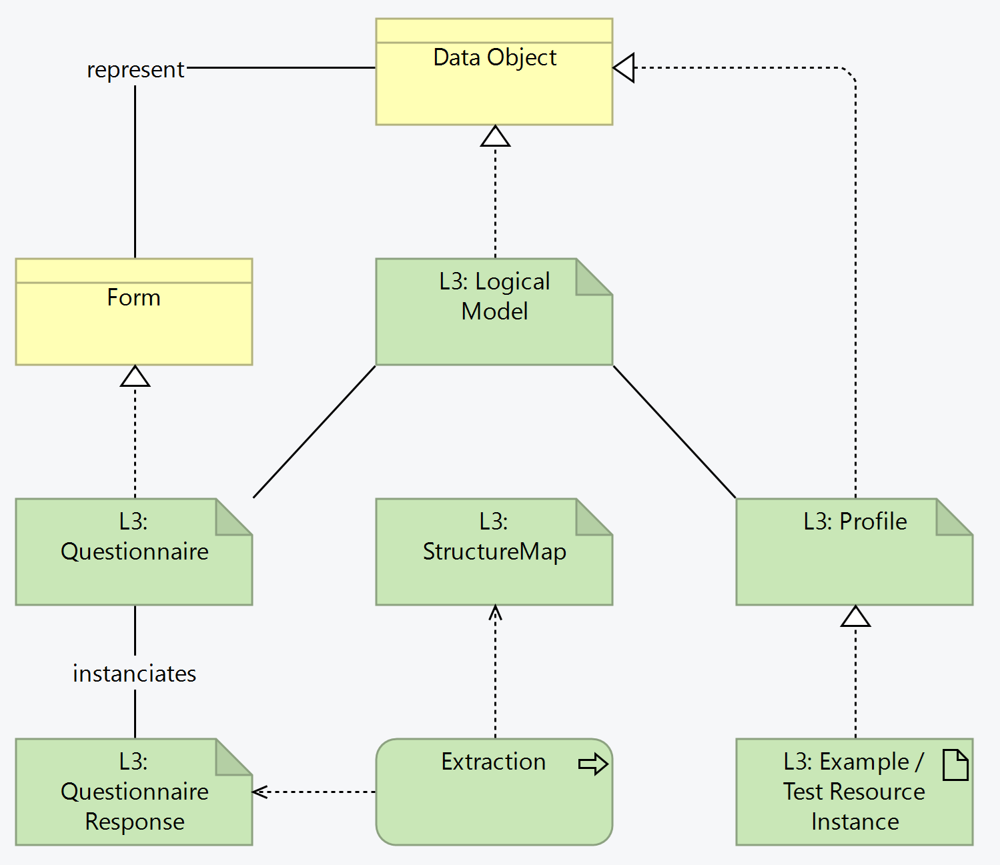

# Forms - SMART Guidelines Starter Kit v2.1.0

* [**Table of Contents**](toc.md)
* [**L3 Authoring Overview**](authoring_overview.md)
* [**Authoring Conventions**](authoring_conventions.md)
* **Forms**

## Forms

Data used in the different stages of the business processes can be captured from the system, or directly from the user. When data is intended to be captured from the user, a form is created, which in L3 terms corresponds to a Questionnaire.

Since the purpose of the forms is to expose data in a user-friendly manner (and following the L2 DAK data structures), it is expected that several of these forms will result in the data being extracted to FHIR-native resources, like Patient, Observation, Condition, etc. This means the L2 data structures are represented both as instances Questionnaires and as FHIR resource profiles, and these FHIR resources can be obtained natively or by extracting a QuestionnaireResponse:  

SMART Guidelines make use of the [FHIR Structured Data Capture specification](http://hl7.org/fhir/uv/sdc) to define the common aspects around Questionnaire resources:

* Design
* Reuse
* Data extraction

Forms are reuse other forms and make use of value sets.

This extraction uses [structure maps](l3_structuremaps.md) and is represented as follows:

### Inputs

* Logical model
* ValueSets associated with logical model

### Outputs

* Questionnaires
* Example QuestionnaireResponses for testing
* Questionnaires elements may link to the data elements in the common definitions, when those common definitions exist 
* Note that this can conflict with the definition-based extraction described below
 

### Activities

For each data element in the logical model (i.e. in the data dictionary)

* For extracting data, ensure the Questionnaire is an instance of [SDC extractable questionnaire profile](http://hl7.org/fhir/uv/sdc/StructureDefinition/sdc-questionnaire-extr-smap) 
* For StructureMap extraction, the extension [Target Structure Map](http://hl7.org/fhir/uv/sdc/StructureDefinition/sdc-questionnaire-targetStructureMap) needs to be present. See [Authoring StructureMaps](l3_structuremaps.md) for authoring of structuremaps.
 
* The Questionnaire shall indicate what is the StructureMap that should be used for extracting the data, using the [`targetStructureMap`](http://hl7.org/fhir/uv/sdc/StructureDefinition/sdc-questionnaire-targetStructureMap) extension.
* Define the questionnaire extraction in 2 steps - 
1. transform a QuestionnaireResponse to a logical model instance ;
1. transform a logical model instance into the FHIR resources. These shall be 2 StructureMaps, and a third StructureMap that includes these 2 and runs the two transformations one after the other.
 
* The StructureMap that is mentioned in the Questionnaire is the one corresponding to the **combined** transformation. 
* for example: ```
 
* extension[+].url = "http://hl7.org/fhir/uv/sdc/StructureDefinition/sdc-questionnaire-targetStructureMap"
* extension[=].valueCanonical = "http://worldhealthorganization.github.io/smart-example-immz/StructureMap/IMMZCQRToResources" ```

StructureMap authoring requires tooling for validation. Please see the tooling section below.

### Output Criteria / Definition of Done

* For using the $extract operation, Questionnaires shall have the extension pointing to the StructureMap, and the map should also be present (see [Authoring StructureMaps](l3_structuremaps.md).)
* Example instances of the QuestionnaireResponses, the corresponding Logical Model instance and the FHIR resources are available (the latter should actually be obtained by running the data extraction).
* No QA errors in the build
* Confirmation that extraction is working with the reference extraction tool.
* Questionnaires SHALL conform to [CRMIShareableQuestionnaire](https://hl7.org/fhir/uv/crmi/StructureDefinition-crmi-shareablequestionnaire.html)
* Active, published Questionnaires SHALL conform to [CRMIPublishableQuestionnaire](https://hl7.org/fhir/uv/crmi/StructureDefinition-crmi-publishablequestionnaire.html)
* Questionnaires SHALL conform to [CPGComputableQuestionnaire](https://build.fhir.org/ig/HL7/cqf-recommendations/StructureDefinition-cpg-computablequestionnaire.html)
* Questionnaires SHALL conform to [SDCBaseQuestionnaire](https://hl7.org/fhir/uv/sdc/STU3/StructureDefinition-sdc-questionnaire.html)
* Questionnaires SHOULD conform to other [SDC Questionnaire Profiles](https://hl7.org/fhir/uv/sdc/STU3/artifacts.html#structures-resource-profiles) if they support other rendering and questionnaire behavior described by SDC.

### Change tracking

As with all FHIR Conformance resources, change management is critical. Do not set the version element of Questionnaires and StructureMaps defined in the SMART Guideline, the version element will be set by the publication process. See the [versioning](versioning.md) topic for more information on change management.

Example instances (QuestionnaireResponse, logical model instance, and FHIR resource instances) may be tracked.

### Tooling

| | | |
| :--- | :--- | :--- |
| Matchbox | Compile FML files; Extract data |   |
| LHC Form viewer | Display questionnaires |   |
|   |   |   |

Several SDC-related tools and implementations are available from the [HL7 Confluence](https://confluence.hl7.org/display/FHIRI/SDC+Implementations).

### Informative examples

[SMART Guidelines - Immunizations (Measles): Questionnaires](https://worldhealthorganization.github.io/smart-example-immz/artifacts.html#structures-questionnaires)

### Known issues and dependencies

