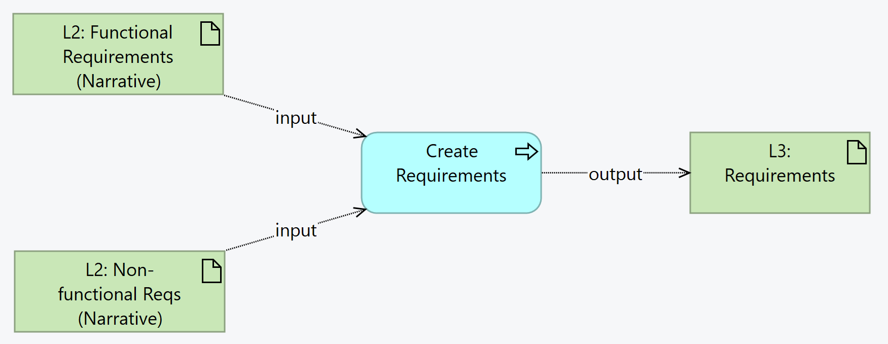

# Requirements - SMART Guidelines Starter Kit v2.1.0

* [**Table of Contents**](toc.md)
* [**L3 Authoring Overview**](authoring_overview.md)
* [**Authoring Conventions**](authoring_conventions.md)
* **Requirements**

## Requirements

Requirements - functional or non-functional - are captured as L3 artifacts for the purposes of:

* Reusability across SMART Guidelines
* Adaptability to jurisdiction-specific guidelines
* Traceability - for example to Testing

The L3 author is expected to capture the requirements in a [Requirements](https://worldhealthorganization.github.io/smart-base/StructureDefinition-SGRequirements.html) resource.

The requirements capture the following data:

### Inputs

* Personas, Processes and Requirements from L2
* Personas and Processes from L3

### Outputs

* Requirements resources for all functional and non-functional requirements

### Activities

 

> Summary: From the Functional and Non-Functional requirements in the L2, the L3 author creates Requirements resources.

In FHIR, the resource used is a Requirements - which is a set of requirement statements. So, each requirement in the L2 group will normally be one of the statements included in a Requirements resource. The Requirements resource identifies the Business Process for which the requirements are being expressed e.g "Register Client".

The Requirements will capture the following elements:

* id: the unique id of the requirement set, using the convention `<sg>-
-fxnreq`, where `<sg>` is the abbreviation of the SMART guideline (e.g. `immz`) and `
` is the letter of the functional process e.g. `e` corresponding to "Register Client".
* title:
* status
* statement: one statement for each requirement, e.g. 
* key: the unique id of the requirement e.g. `IMMZ.FXNREQ.087`
* label: an optional short label for the requirement
* conformance: the optional strength of the requirement
* requirement: The actual text, as a Scrum-like description: 
* **"As a "** … [Persona]
* **"I want"** … [Functionality/activity]
* **"So that"** … [Functional goal]
 
 

### Output Criteria / Definition of Done

* Each requirement shall be associated with a Persona.
* Each Functional requirement shall have a link to a business [Process] that it is associated with 
* Each Functional requirement should have an Activity ID
 
* Each requirement shall have a unique id, a title, and the Scrum-like description.

### Change tracking

As with all FHIR Conformance resources, change management is critical. Do not set the version element of Requirements defined in the SMART Guideline, the version element will be set by the publication process. See the [versioning](versioning.md) topic for more information on change management.

In addition, Requirements are essential traceable artifacts. Every time a requirement changes, the change history shall be appended.

### Tooling

| | | |
| :--- | :--- | :--- |
| Sushi | Requirements can be authored in FSH syntax | [HL7 Spec](https://build.fhir.org/ig/HL7/fhir-shorthand/reference.html)[Sushi Documentation](https://fshschool.org) |

### Informative examples

[SMART Guidelines - Immunizations (Measles): Rendered Requirements table](https://worldhealthorganization.github.io/smart-example-immz/functional-requirements.html) [SMART Guidelines - Immunizations (Measles): Example Requirements resource](https://worldhealthorganization.github.io/smart-example-immz/Requirements-immz-e-fxnreq.html)

### Known issues and dependencies

